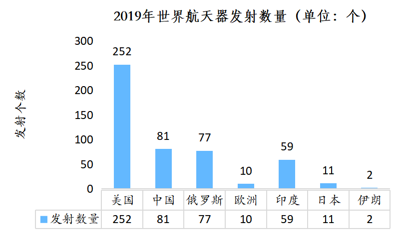
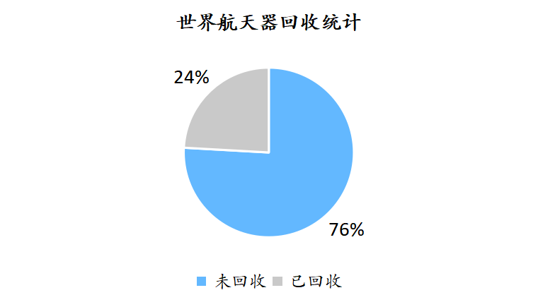
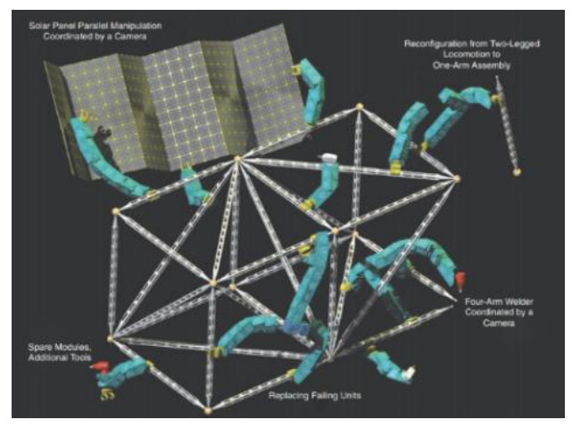
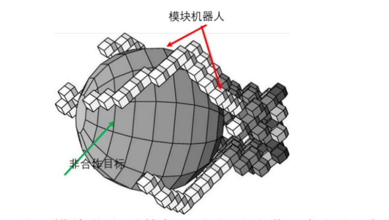
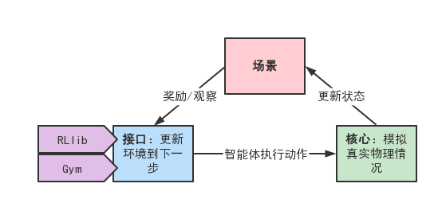
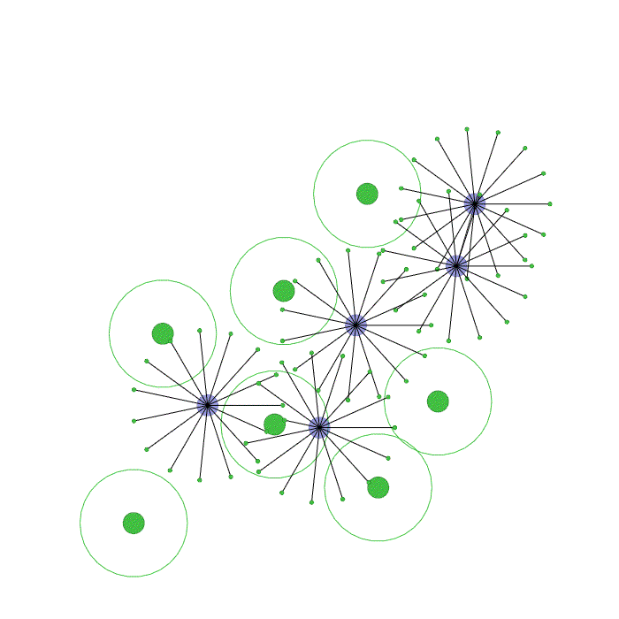
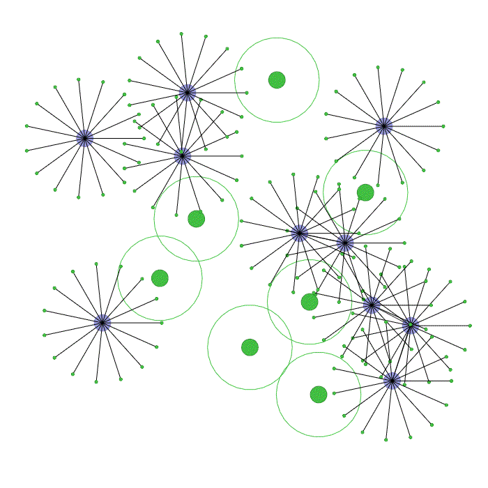
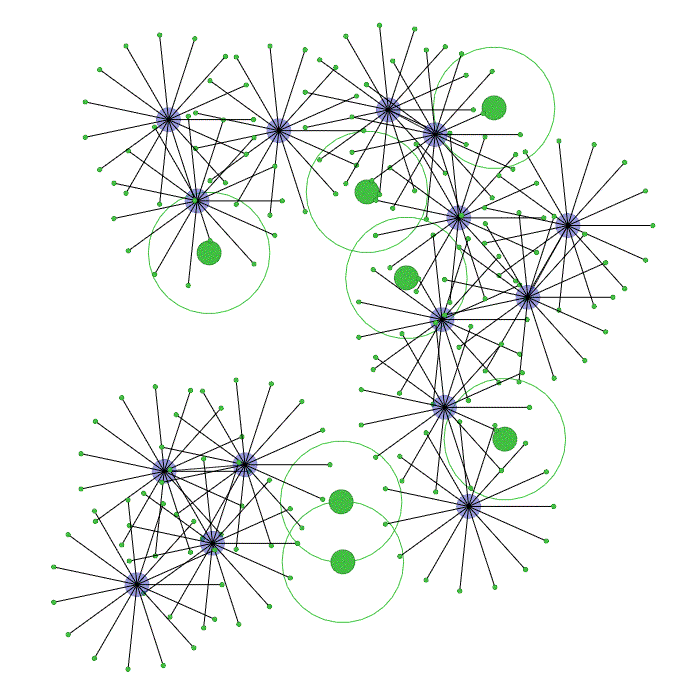

# Galaxy Ants
<a href="https://pypi.org/project/vmas"></a>
[](https://pepy.tech/project/vmas)

[](https://www.python.org/downloads/)
[](https://github.com/proroklab/VectorizedMultiAgentSimulator/blob/main/LICENSE)

<p align="center">
  
</p>

## Welcome to Galaxy Ants!

Galaxy Ants is an aerospace intelligent control algorithm service platform. The algorithm provider uploads cutting-edge intelligent control algorithms to this platform. The algorithm user can download the algorithm to the local machine for secondary development, or use tools such as Docker, Vercel to achieve one-click deployment.


## Table of contents

- [Galaxy Ants](#galaxy-ants)
  * [Welcome to Galaxy Ants!](#welcome-to-galaxy-ants!)
  * [Table of contents](#table-of-contents)
  * [How to use](#how-to-use)
    + [Notebooks](#notebooks)
    + [Install](#install)
  * [Background](#background)
    + [Notebooks](#business-motivation)
    + [Install](#innovation)
  * [Algorithm Design](#algorithm-design)
  * [Results](#results)
    + [Intuitive](#intuitive)
    + [Install](#efficiency)

## How to use
### Notebooks
-  [](https://colab.research.google.com/drive/10R6KIRG5grpBFBDUI5njTcKvZ2rqsaWd?usp=share_link) &ensp; **Running oline**.
 Here is a simple notebook that you can run to create, step and render a senario using multi-agent reinforcement learning algorithm.

### Install

If you want to install the current master version (more up to date than latest release), you can do:
```
git clone https://github.com/davelee2001/GalaxyAnts.git
cd VectorizedMultiAgentSimulator
pip install -e .
```
By default, GalaxyAnts has only the core requirements. Here are some optional packages you may want to install:
```
# Training
pip install "ray[rllib]"==2.2 # We support versions "ray[rllib]<=2.2,>=1.13"
pip install torchrl

# Logging
pip installl wandb 

# Save renders
pip install opencv-python moviepy

# Tests
pip install pytest pyyaml pytest-instafail tqdm
```


## Background
### Business Motivation
According to statistics from the China Society of Space Research, by the end of 2019, a total of 9,467 spacecraft had been launched globally, among which over 1,800 satellites were in orbit operation, and there were also thousands of failed satellites and millions of space debris and fragments (collectively known as non-cooperative space objects) flying in orbit. Non-cooperative space objects, due to their inability to function properly, can cause significant economic losses and potential collisions with other functional satellites, leading to further degradation of the space environment. Therefore, capturing, removing, or taking control of non-cooperative targets is an important issue in space control.
<p align="center">
  
   
</p>

### Innovation
The Galaxy Ants Team proposed a new method for capturing space debris using bionic ant colony intelligence attachment and variation techniques. The team researched the principles of modular robot path planning and cluster topology related to ant colony simulation, conducted modeling and developed artificial intelligence algorithms based on reinforcement learning, and validated them using existing experimental platforms. At the same time, we will establish an algorithm marketplace and virtual community to promote the commercialization of university research achievements.
<p align="center">
  
   
</p>

## Algorithm Design
Galaxy Ants: The reinforcement learning algorithm adopted combines multi-agent learning and environment vectorization. Vectorization is a key component in accelerating multi-agent reinforcement learning training. In fact, the online policy iteration that occurs simultaneously with policy updates includes two stages: simulating team rounds and policy updates. In the simulation team round stage of each iteration, experiences are collected by executing simulations based on the interaction between the agents' policies and the environment. Then, the collected experiences are used to update the team policy. The update of the new policy is achieved by combining the experience data with the agent's learning algorithm. The new policy will be adopted in the next iteration's simulation team round stage. The simulation team round stage is usually the bottleneck of this process. Vectorization allows for parallel simulation, which helps alleviate this issue. This is the core of the reinforcement learning algorithm."
 
## Results
All algorithms in this work are implemented using Python code. The Python files have been updated and maintained to the latest version, and usage instructions are provided. The following images show the rendering process of multi-agent reinforcement learning for task point coverage with 5, 10, and 15 agents, respectively. As the number of agents increases, the time required to compute 500 iterations on a single AMD Ryzen 4800H CPU increases from 124.72 seconds to 231.25 seconds and eventually to 341.36 seconds. The increase in computation time is linear and acceptable.
<p align="center">
  
   
   
</p>